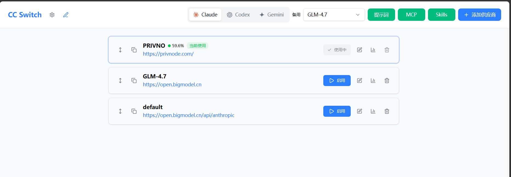
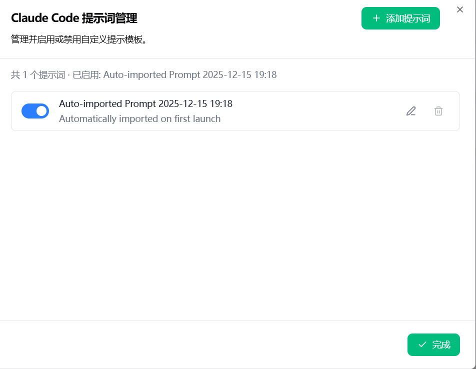
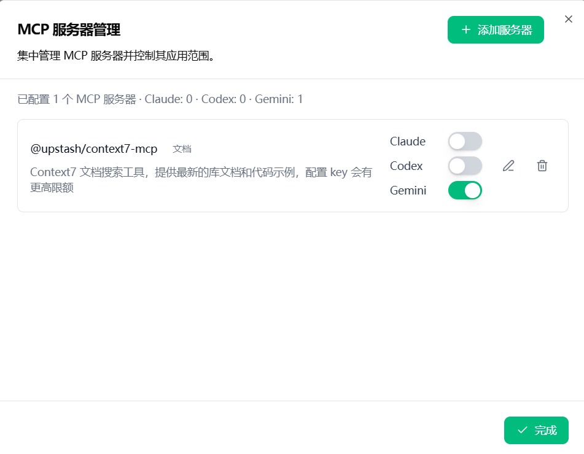
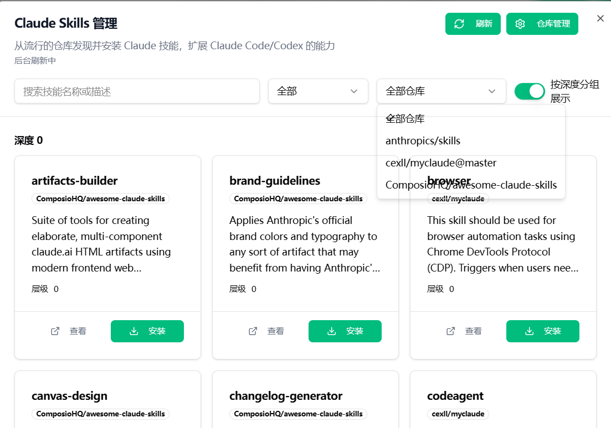

# cc-switch-web

> Web-based CC Switch for Claude Code, Codex, Gemini CLI, OpenCode, OMO & Hermes Agent.

<sub>🙏 This project is a fork of [farion1231/cc-switch](https://github.com/farion1231/cc-switch) by Jason Young. Thanks to the original author for the excellent work. This fork adds Web Server mode for cloud/headless deployment, plus Hermes Agent integration.</sub>

[](https://github.com/Bandersnatch0x/cc-switch-web/releases/latest)
[](LICENSE)

**Cross-platform web-based All-in-One assistant for Claude Code, Codex, Gemini CLI, OpenCode, OMO & Hermes Agent**

English | [中文](README_ZH.md) | [Legal Notice](LEGAL_NOTICE.md) | [Changelog](CHANGELOG.md)

## About / 项目简介

**cc-switch-web** is a cross-platform web-based **CC Switch** for **Claude Code**, **Codex**, **Gemini CLI**, **OpenCode**, **oh-my-opencode (OMO)**, and **Hermes Agent**. It lets you switch providers, manage MCP servers, install skills, edit system prompts, and run the same workflow on desktop or headless cloud environments.

Whether you're working locally or in a headless cloud environment, cc-switch-web offers a seamless experience for:

- **One-click provider switching** between OpenAI-compatible API endpoints
- **Unified MCP server management** across Claude/Codex/Gemini/OpenCode/Hermes
- **Skills marketplace** to browse and install Claude skills from GitHub
- **System prompt editor** with syntax highlighting
- **Configuration backup/restore** with version history
- **Web server mode** for cloud/headless deployment with Basic Auth
- **Hermes Agent integration** with auto-rotation, Token Plan templates, and remote terminal

---

## What's New

### v1.0.0 — Hermes Agent & Terminal

- **Hermes Agent support**: Full integration as a managed app with provider switching, directory settings, and capability flags
- **Token Plan templates**: One-click config for Kimi, Zhipu, MiniMax via Anthropic-compatible endpoints
- **AgentSidebar**: New sidebar layout with plugin mode filtering (shows only Hermis in plugin mode)
- **RemoteTerminal**: Built-in xterm.js terminal with WebSocket PTY binary protocol
- **Auto-rotation backend**: Hermes rotation task starts automatically with the web server
- **i18n audit**: 88 missing translation keys added across en.json and zh.json

### v0.11.0-rc.2 - Prerelease

- Add Web/headless local HTTP forward proxy v1 with Settings controls for start, stop, status, test, and auto-start
- Harden proxy startup and takeover UX based on real server testing
- Prevent repeated proxy takeover requests and duplicate/stuck takeover toasts

### v0.10.1 - Stable Release

- Recommended for daily use and production
- Download stable builds from: [v0.10.1](https://github.com/Laliet/cc-switch-web/releases/tag/v0.10.1)

## Screenshots


_Main Interface_


_Prompt Management_


_MCP Server Management_


_Skills Marketplace_

---

## Features

### Core Features

- **Multi-Provider Management**: Switch between different AI providers (OpenAI-compatible endpoints) with one click
- **Unified MCP Management**: Configure Model Context Protocol servers across Claude/Codex/Gemini/OpenCode/Hermes
- **Skills Marketplace**: Browse and install Claude skills from GitHub repositories
- **Prompt Management**: Create and manage system prompts with a built-in CodeMirror editor
- **Remote Terminal**: Built-in terminal with xterm.js + WebSocket PTY for direct server shell access

### Extended Features

- **Backup Auto-failover**: Automatically switch to backup providers when primary fails
- **Hermes Auto-Rotation**: Automatic provider rotation for Hermes Agent with configurable plans
- **Import/Export**: Backup and restore all configurations with version history
- **Cross-platform**: Available for Windows, macOS, Linux (desktop) and Web/Docker (server)

---

## Quick Start

### Option 1: Web Server Mode (Recommended)

Lightweight web server for headless environments. Access via browser, no GUI dependencies.

#### Method A: Prebuilt Binary (Recommended)

Download precompiled server binary—no compilation required:

| Architecture              | Download                                                                                                                          |
| ------------------------- | --------------------------------------------------------------------------------------------------------------------------------- |
| **Linux x86_64 (glibc)**  | [cc-switch-server-linux-x86_64](https://github.com/Bandersnatch0x/cc-switch-web/releases/latest)                                   |
| **Linux aarch64 (glibc)** | [cc-switch-server-linux-aarch64](https://github.com/Bandersnatch0x/cc-switch-web/releases/latest)                                  |

**One-Line Deploy**:

```bash
curl -fsSL https://raw.githubusercontent.com/Bandersnatch0x/cc-switch-web/main/scripts/deploy-web.sh | bash -s -- --prebuilt
```

#### Method B: Docker Container

```bash
docker run -p 3000:3000 ghcr.io/bandersnatch0x/cc-switch-web:latest
```

#### Method C: Build from Source

Dependencies: `libssl-dev`, `pkg-config`, Rust 1.78+, pnpm (no WebKit/GTK needed)

```bash
# 1. Clone and install dependencies
git clone https://github.com/Bandersnatch0x/cc-switch-web.git
cd cc-switch-web
pnpm install

# 2. Build web assets
pnpm build:web

# 3. Build and run server
cd src-tauri
cargo build --release --features web-server --example server
HOST=0.0.0.0 PORT=3000 ./target/release/examples/server
```

### Web Server Login

- **Username**: `admin`
- **Password**: Auto-generated on first run, stored in `~/.cc-switch/web_password`
- **CORS**: Same-origin by default; set `CORS_ALLOW_ORIGINS=https://your-domain.com` for cross-origin
- **Note**: Web mode doesn't support native file pickers—enter paths manually

### Security

**Authentication**:

- Basic Auth is required for all API requests
- Browser will prompt for credentials (username/password)
- CSRF token is automatically injected and validated for non-GET requests

**Best Practices**:

- Deploy behind a reverse proxy with TLS in production
- Keep `~/.cc-switch/web_password` file secure (mode 0600)

**Environment Variables**:

| Variable | Description | Default |
|----------|-------------|---------|
| `PORT` | Server port | 3000 |
| `HOST` | Bind address | 127.0.0.1 |
| `ENABLE_HSTS` | Enable HSTS header | true |
| `CORS_ALLOW_ORIGINS` | Allowed origins (comma-separated) | (same-origin) |
| `ALLOW_LAN_CORS` | Auto-allow private LAN origins for CORS | false |

### Option 2: Desktop Application (GUI)

Full-featured desktop app with graphical interface, built with Tauri.

```bash
# Install dependencies
pnpm install

# Run in dev mode
pnpm tauri dev

# Build
pnpm tauri build
```

---

## Usage Guide

### 1. Adding a Provider

1. Launch CC-Switch and select your target app (Claude Code / Codex / Gemini / OpenCode / OMO / Hermes)
2. Click **"Add Provider"** button
3. Choose a preset or select "Custom"
4. Fill in: Name, Base URL, API Key, Model

### 2. Switching Providers

- Click the **"Enable"** button on any provider card to activate it
- The active provider will be written to your CLI's config file immediately

### 3. Managing MCP Servers

1. Go to **MCP** tab
2. Click **"Add Server"** to configure a new MCP server
3. Choose transport type: `stdio`, `http`, or `sse`

### 4. Installing Skills

1. Go to **Skills** tab
2. Browse available skills from configured repositories
3. Click **"Install"** to add a skill

### 5. Hermes Token Plan

1. Go to **Hermes** tab → **Token Plan**
2. Select a preset template (Kimi / Zhipu / MiniMax)
3. API key and base URL are auto-filled
4. Enable auto-rotation if desired

### 6. Remote Terminal

1. Click the terminal icon in the sidebar
2. A full xterm.js terminal opens in a dialog
3. Connected via WebSocket PTY binary protocol to the server shell

---

## Configuration Files

| App             | Config Files                                      |
| --------------- | ------------------------------------------------- |
| **Claude Code** | `~/.claude.json` (MCP), `~/.claude/settings.json` |
| **Codex**       | `~/.codex/auth.json`, `~/.codex/config.toml`      |
| **Gemini**      | `~/.gemini/.env`, `~/.gemini/settings.json`       |
| **Hermes**      | `~/.hermes/config.json`                           |

CC-Switch's own config: `~/.cc-switch/config.json`

---

## Development

```bash
# Install dependencies
pnpm install

# Run desktop app in dev mode
pnpm tauri dev

# Run only the frontend dev server
pnpm dev:renderer

# Build web assets
pnpm build:web

# Build and run web server
cd src-tauri && cargo run --example server --features web-server

# Run type check
npx tsc --noEmit

# Run tests
pnpm test:unit
```

---

## Tech Stack

- **Frontend**: React 18, TypeScript, Vite, Tailwind CSS, TanStack Query, Radix UI, CodeMirror, react-i18next, xterm.js, Zustand
- **Backend**: Rust, Tauri 2.x, Axum (web server mode), tower-http
- **Tooling**: pnpm, Vitest, MSW

---

## Changelog

See [CHANGELOG.md](CHANGELOG.md)

---

## Credits

This project is a fork of **[cc-switch](https://github.com/farion1231/cc-switch)** by Jason Young (farion1231). We sincerely thank the original author for creating such an excellent foundation. Without the upstream project's pioneering work, this project would not exist.

Based on the cc-switch-web fork by Laliet which added web/server runtime, CORS controls, and Basic Auth. This version adds Hermes Agent integration, Token Plan templates, AgentSidebar, RemoteTerminal, and auto-rotation.

---

## License

MIT License — See [LICENSE](LICENSE) for details.
